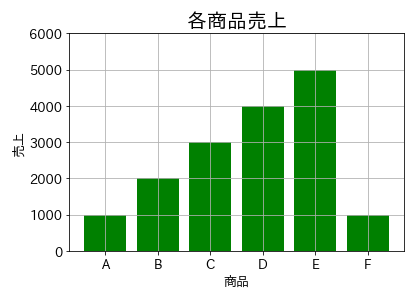
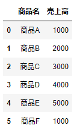
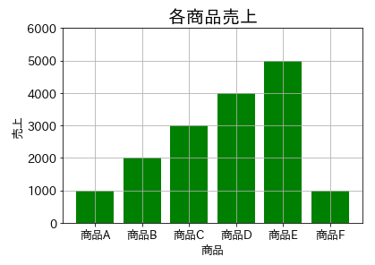
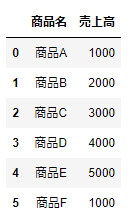
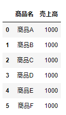
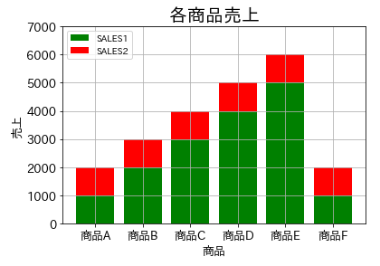

# 棒グラフ表示
商品売上データを例に棒グラフ表示

<br>

## X軸とY軸の値を指定して棒グラフ表示


<br>

## CSVファイルからデータフレーム格納
```
sales
```


<br>

## X軸とY軸にデータフレームの値を設定して棒グラフ表示


<br>

## CSVファイル(FILE1.csv)からデータフレーム格納
```
sales1
```


<br>

## CSVファイル(FILE2.csv)からデータフレーム格納
```
sales2
```


<br>

## 各データフレームのデータを色で区別して積上げ棒グラフ表示


<br>
